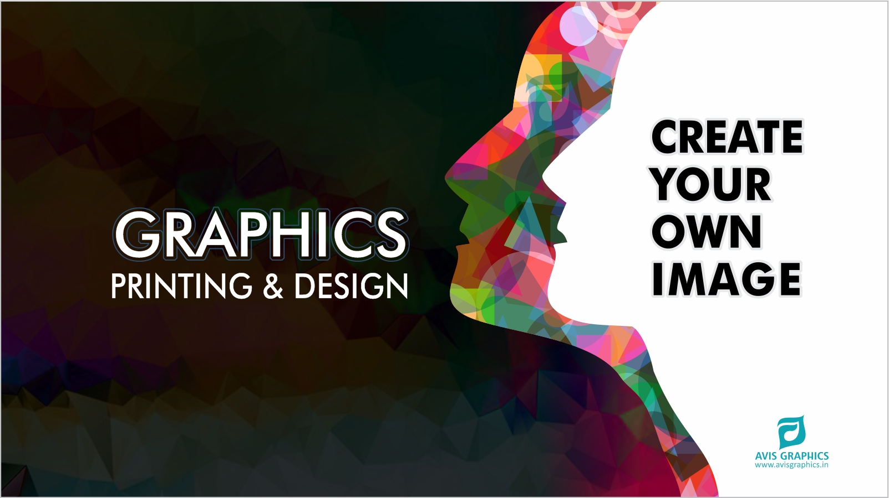

            ЧЕРНОВИК / ЗАМЕТКИ.

            <ul class="works-gallery">
                <li class="gallery-item" data-type-Work="gd">
                    
                    <!-- 

                        

                            

                            

                        

                        
CREATIVE DESIGN

                        
Web Design

                    
 -->
                </li>
                <li class="gallery-item" data-type-Work="wd">
                    
                    <!-- 

                        

                            

                            

                        

                        
CREATIVE DESIGN

                        
Web Design

                    
 -->
                </li>
                <li class="gallery-item" data-type-Work="lp">
                    
                    <!-- 

                        

                            

                            

                        

                        
CREATIVE DESIGN

                        
Web Design

                    
 -->
                </li>
                <li class="gallery-item" data-type-Work="wp">
                    
                    <!-- 

                        

                            

                            

                        

                        
CREATIVE DESIGN

                        
Web Design

                    
 -->
                </li>
                <li class="gallery-item" data-type-Work="gd">
                    
                    <!-- 

                        

                            

                            

                        

                        
CREATIVE DESIGN

                        
Web Design

                    
 -->
                </li>
                <li class="gallery-item" data-type-Work="wd">
                    
                    <!-- 

                        

                            

                            

                        

                        
CREATIVE DESIGN

                        
Web Design

                    
 -->
                </li>
                <li class="gallery-item" data-type-Work="lp">
                    
                    <!-- 

                        

                            

                            

                        

                        
CREATIVE DESIGN

                        
Web Design

                    
 -->
                </li>
                <li class="gallery-item" data-type-Work="wp">
                    
                    <!-- 

                        

                            

                            

                        

                        
CREATIVE DESIGN

                        
Web Design

                    
 -->
                </li>
                <li class="gallery-item" data-type-Work="gd">
                    
                    <!-- 

                        

                            

                            

                        

                        
CREATIVE DESIGN

                        
Web Design

                    
 -->
                </li>
                <li class="gallery-item" data-type-Work="wd">
                    
                    <!-- 

                        

                            

                            

                        

                        
CREATIVE DESIGN

                        
Web Design

                    
 -->
                </li>
                <li class="gallery-item" data-type-Work="lp">
                    
                    <!-- 

                        

                            

                            

                        

                        
CREATIVE DESIGN

                        
Web Design

                    
 -->
                </li>
                <li class="gallery-item" data-type-Work="wp">
                    
                    <!-- 

                        

                            

                            

                        

                        
CREATIVE DESIGN

                        
Web Design

                    
 -->
                </li>
            </ul>

подключение библиотеки css

<link rel="stylesheet" href="https://cdnjs.cloudflare.com/ajax/libs/font-awesome/4.7.0/css/font-awesome.min.css">
